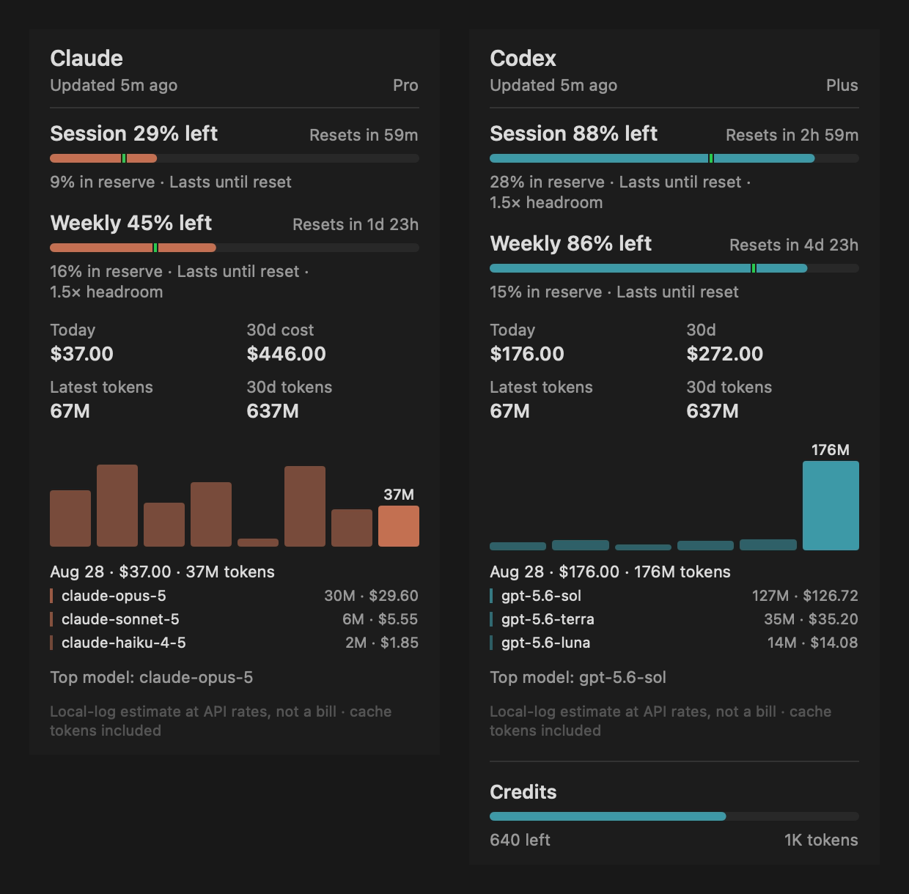
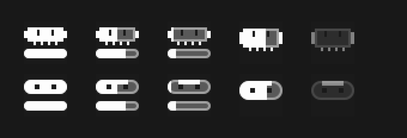
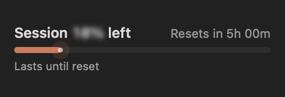
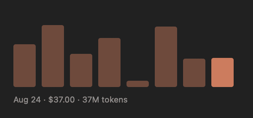
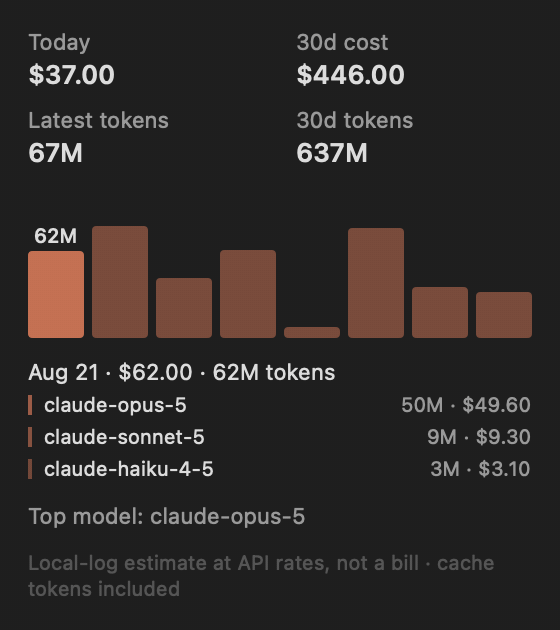
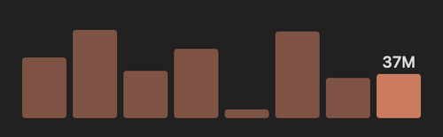
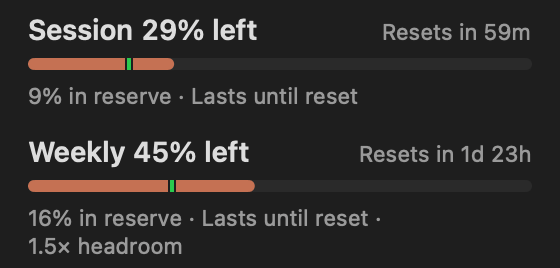
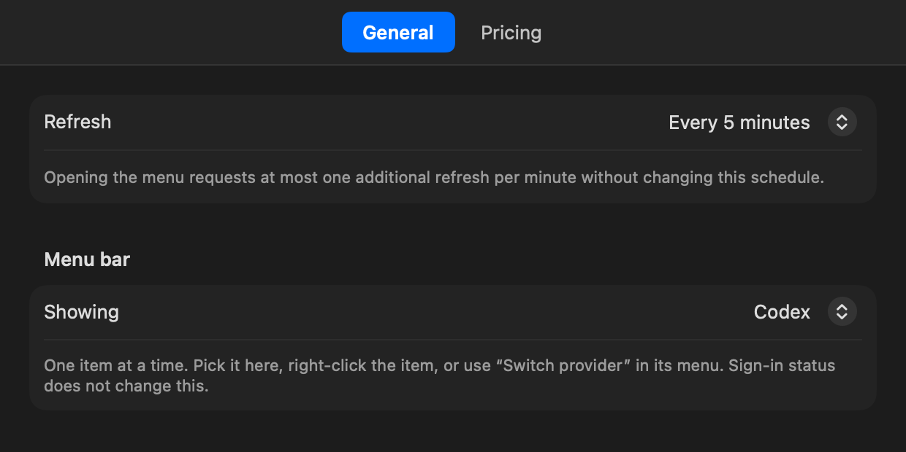
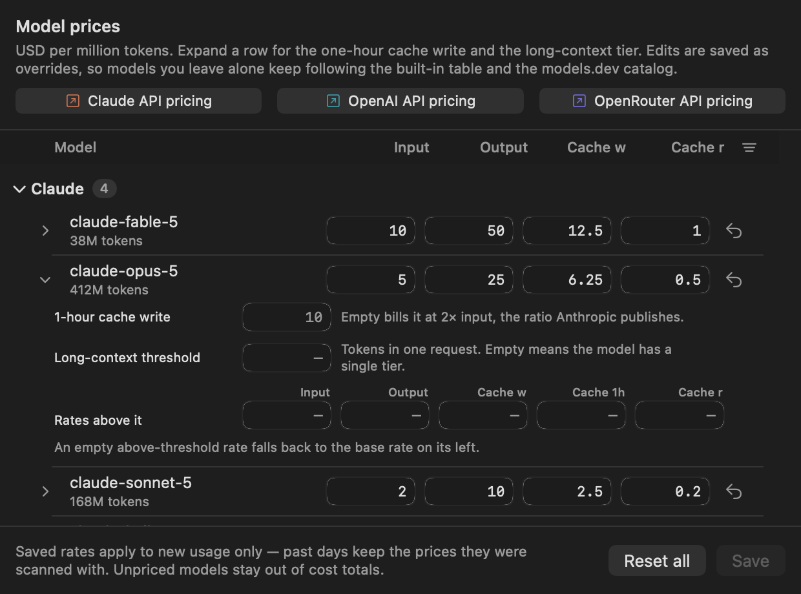

# AgentUsageBar

<p align="center">
  
</p>

<p align="center">
  <a href="README.md"></a>
  <a href="README.zh-CN.md"></a>
</p>

一个 macOS 菜单栏应用，用来看 Codex 和 Claude 还剩多少额度、本地花了多少钱、窗口什么时候重置。

它是 [CodexBar](https://github.com/steipete/CodexBar) 的精简重写版。CodexBar 覆盖一长串 agent CLI，
这个只做两家：Codex 和 Claude，把省下来的地方花在每天真正会看的部分上。菜单栏只占一个图标，卡片
一屏放得下，所有动效出自同一条曲线，而不是五条。



## 「精简」精简掉了什么

每个从 CodexBar 移植过来的文件，文件头都写清楚了保留什么、丢掉什么。概括如下：

| 保留 | 丢掉 |
| --- | --- |
| Codex `wham/usage`、Claude `/api/oauth/usage` | Gemini、Antigravity、Factory、Warp |
| 会话与周额度窗口、credits | 消费限额、按模型的额外限流、workspace 解析 |
| 线性与历史两套用量节奏模型 | 工作日加权进度、耗尽风险百分比 |
| 两家 CLI 的本地成本扫描 | profile 查询、超额计费、网页兜底 |
| 胶囊图标和它的两个装饰 | 眨眼、扭动、倾斜、状态角标、morph 缓存 |

腾出来的地方给了动效。CodexBar 的进度条直接跳到新值；这里的进度条是冲进去的，上面的数字跟着一起冲。

## 菜单栏图标



上排 Claude，下排 Codex。从左到右：充足、用掉一半、快见底、只有会话窗口、刷新失败后的置灰状态。
图标按 18pt 的 2x 像素网格绘制，边缘落在像素边界上，所以不会发虚。

菜单栏永远只有一个图标。右键点它切换到另一家，选择会保留到下次启动。只有屏幕上这一家会刷新，
而且两家各自有一分钟冷却，来回切也不会在一分钟内重复请求同一家。

## 重置动效

五小时或每周窗口翻过去之后，下一次打开卡片会播这段。



进度条从重置前看到的最后一个读数接着走，一路连续减速走进新读数，头部后面不拖任何东西。整段动效
的落点就是抵达 100% 这一下：回弹、闪光、条下方泛起的辉光全部压在这一拍上。落地时画面里没有任何
边缘。告诉你额度满了的是整条进度条暖起来，而不是在头部停下的位置画一个形状。

百分比数字是跟着填充一起到位的，而不是在进度条还在冲的时候就已经是正确读数。它用的是填充自己的
缓动曲线，在数字翻得最快的时候发虚，于是它是「化」进新读数而不是「停」在新读数上，落地也走同一拍。
时钟只有一个，由进度条持有并逐帧发布，数字只负责渲染这些帧，两者不可能对不齐。

五小时和每周窗口各自独立跟踪。正常消耗不会触发这段动效。重启之后，最后的读数和尚未播放的重置都
还在。想再看一次就在进度条上连点五下。

## 其他会动的地方

用的是同一套动效语汇：一条指数衰减表示「正在充能」，一条阻尼正弦表示「落地了」，从庆祝的长度
压缩到一次点击的长度。

**设置页标签**是自己画的，没交给 AppKit，因为系统标签栏没有地方放曲线。选中态是一个胶囊，
它的两条边跑同一条缓动但时长不同：朝目标那一侧先走，后面那一侧追上来，所以胶囊会短暂地横跨
两段，然后收缩到新的那一段上。它不会同时出现在两处，也不会卡在中间两边都不覆盖。断言套件会
逐帧走一遍曲线检查形状。


**价格表**的分组和每个模型的展开走填充那条缓动，行与行之间错开 35ms，于是一组是从表头下面卷
出来的，而不是整块同时出现。箭头是转四分之一圈，不是换成另一个图标。只有控件本身有弹性：表格
如果超调自己的高度，会把下面每一行都顶一下，那读起来像 bug 而不像节奏。

按下的反馈按被按的东西的大小给。模型行的箭头只有 9pt，所以它按下去缩到 0.86，再顺着落地那条
弹簧弹回来。供应商表头是整行那么宽，同样的幅度放在这么大一块上，读起来像整张表抖了一下，所以它
只缩到 0.985，走 100ms 的 ease-out 回来，不会超调。它是和「只有箭头缩」「只有底色变」「完全
不给反馈」比过之后定下来的。


**成本图表**会把高亮那根柱子抬高 5pt，并展开它当天的按模型明细。在柱子之间移动是在追指针，
走的是快速弹簧；回到今天不是用户瞄准的动作，所以更长、用临界阻尼，高亮是落到今天而不是弹到
今天。



悬停某一根柱子会展开那天到底是由什么构成的：



点高亮的那根柱子，标签在 token 数和金额之间换，整张图表也跟着重新缩放：



这个单位同时也是图表的高度口径。每根柱子按标签读的那个单位量，再拿同一单位下最高的那天当基准，
所以一次点击换掉的是柱子本身和它们量度的那把尺。一周里如果大部分 token 是便宜模型花掉的，那这
一周换成金额就是另一个形状，而这个差别正是你会去点它的原因。柱高走的是读数析出的那条 260ms 曲线，
所以图形和数字是一起到的。

读数本身不动。这一下点在指针本来就停着的柱子上，所以这次切换没有距离要走：旧读数糊开，新读数在
原地从模糊中析出。这正是在说这两个读数是同一个量的两种数法。把一个数推开、让另一个滑进来，说的
会是「标签被换掉了」。默认单位是 token，选择会被记住；点在两根柱子中间的缝里不会有任何反应。

**价格表里的费率输入框**拿到焦点时，会在 90ms 里淡入一圈 1 像素的系统强调色描边。聚焦前后框
的尺寸完全一样，描边画在它原本就占的那个框里面：每行有四个这样的框，一圈自己要占地方的焦点环
会把整行顶一下。它是和内描边、淡色底、下划线，以及它替掉的那个原生 `.roundedBorder` 输入框
比过之后定下来的。

**指针**也会动。Codex 卡片比 Claude 卡片高，而菜单只能向下长，所以切换供应商时下面每一行都会
从没动过的指针底下滑走。指针会跟着位移同样的距离，继续指着原来那一行。

打开 **系统设置 → 辅助功能 → 显示 → 减弱动态效果**，上面所有动效都变成直接切换。不是变慢，
是直接切。

## 卡片

左键点图标打开。每个额度窗口显示还剩多少、什么时候重置，以及跟「按时钟均匀消耗」相比处在什么位置。
`9% in reserve` 表示你用得比时钟慢；红色的节奏标记表示你用得更快。等到有三个可比的窗口跑完之后，
周额度那一行就不再跟时钟比，而是跟你自己记录下来的历史周比。

点任意一个 **`Resets in …`** 标签，倒计时会换成它正在倒数的那个时刻：当天显示 `Resets 3:30 PM`，
更远的显示 `Resets Sat 9:00 AM`。



指针移上去时标签会变亮。卡片上除了图表，没有别的东西会对指针有反应，所以这一点提亮就是「这行
是个开关」的全部提示。一次点击会同时改掉两个窗口，因为这个选择属于卡片，不属于你点的那一行；
重启之后也还在。哪一面更有用，一天之内是会变的：倒计时回答「还能撑多久」，时刻回答「赶在它重置
之前做完来得及吗」。

菜单里有 `Switch provider`、`Refresh`、`Settings`（⌘,）和 `Quit`（⌘Q）。Refresh 受一分钟冷却
约束，冷却期间它会在行上把剩余秒数数出来，而不是默默吞掉你的点击。打开菜单会立刻请求刷新当前
这一家，但不会重置后台定时器。



后台刷新可以设为手动，或每 1、2、5、15、30 分钟一次。默认 5 分钟，因为额度接口是和 CLI 共用的，
问得太勤会被限流。

## 成本与价格



token 和成本统计全部来自两家 CLI 自己的会话日志，不走任何计费 API：

- Codex：`~/.codex/sessions` 和 `~/.codex/archived_sessions`
- Claude：`$CLAUDE_CONFIG_DIR/projects`，未设置时为 `~/.claude/projects` 和 `~/.config/claude/projects`

历史记录多的话第一次扫描会慢一些。之后都是基于 SQLite 缓存的增量扫描。

内置费率之外还会补上公开的 [models.dev](https://models.dev) 目录，缓存 24 小时。刷新失败后一小时
内不重试，面板也从不等它：先用缓存画出来，新目录到了再从后面合进去。

**Settings → Pricing** 把成本计算读到的每一个数字都摆了出来：输入、输出、五分钟缓存写入、缓存
读取、一小时缓存写入（留空则按输入价的两倍计，这是 Anthropic 公布的比例），以及长上下文档位和它
自己的单请求 token 阈值。表格默认按供应商分组，各家的 API 模型保持官方顺序，本地日志里翻出来的
其他模型排在它们下面、用得多的在前。点列头按该列排序，再点一次反序，表头右端的控件恢复默认顺
序；默认顺序生效时它保持高亮，就像被排序的那一列标题一样。

一小时缓存写入和长上下文档位折在箭头后面。点模型名同样能展开这一行，于是可点的目标是整个左半
行，而不是一个 9pt 的箭头。

改过的费率只对之后的用量生效。已经扫描过的记录保留当时的价格，所以编辑不会重写过去的日子。

这些数字都是估算。缓存计费方式、各家的计费规则、价格调整，都会让它和账单对不上。

## 环境要求

- macOS 14 或更高
- Swift 6 工具链（Xcode 或命令行工具）
- 本地已登录 Codex CLI 和/或 Claude Code

只用一家也可以，不需要两家都装。

## 构建

```bash
git clone git@github.com:softmaxe/agent-usage-bar.git
cd agent-usage-bar
make app
open build/AgentUsageBar.app
```

`make app` 按当前架构构建，组装出 `build/AgentUsageBar.app` 并做 ad-hoc 签名。安装：

```bash
ditto build/AgentUsageBar.app /Applications/AgentUsageBar.app
```

这只是本地构建脚本。要分发给别人，还需要 Developer ID 签名、hardened runtime、公证，以及一个
签好名的压缩包或 DMG。

## 登录

AgentUsageBar 直接复用官方 CLI 已经创建好的凭据，自己没有登录流程。

```bash
codex login   # 写入 $CODEX_HOME/auth.json，未设置时为 ~/.codex/auth.json
claude        # 走 CLI 自己的登录流程；token 落在钥匙串里
```

读取 Claude 那条钥匙串记录走的是 Apple 的 `/usr/bin/security`，第一次可能会弹出 macOS 授权提示。

## 隐私与网络

应用只读本地凭据和日志，从不写回。`auth.json` 对它是只读的，刷新出来的 Codex token 只在本次运行
的内存里。它写入的东西都在自己的目录下：

```text
~/Library/Application Support/AgentUsageBar/usage-history.json      额度采样，保留 56 天
~/Library/Application Support/AgentUsageBar/pricing-overrides.json  手动费率，设置后才有
~/Library/Caches/AgentUsageBar/cost-usage/cost-usage.sqlite         增量扫描缓存
~/Library/Caches/AgentUsageBar/model-pricing/                       models.dev 目录，24 小时 TTL
```

成本缓存里存的是会话文件路径、日期、模型名、token 数和费用，从不存 prompt 或回复正文。设置存在
`com.agentusagebar.app` 域下。

只请求三个地址：OpenAI 的 Codex 用量接口、Anthropic 的 OAuth 用量接口，以及可选的 `models.dev`。

## 开发

Swift Package Manager，没有 Xcode 工程。

```bash
make build              # Debug 二进制
make run                # 先杀掉正在跑的实例，再构建并前台运行
make test               # 185 条断言，加 12 个逐帧走动效曲线的验证器
make probe              # 在终端里检查两家的接入是否正常
make probe-cost         # 重扫本地日志并打印成本统计。不用凭据，不联网
make logs               # 输出 com.agentusagebar.app 的 os.Logger 日志流
make app                # 打包 release 版 .app
make readme-assets      # 重新渲染本文里的所有图片。需要 ffmpeg
make clean
```

没有 Xcode 就没有 XCTest，所以测试套件是一个纯断言的可执行文件，外加十二个逐帧采样动效曲线的
验证器。

`make readme-assets` 背后的各个 dump 也是同一个二进制上的参数：`--dump-card`、`--dump-icons`、
`--dump-settings`、`--dump-card-celebration`、`--dump-chart-hover`、`--dump-reset-toggle`、
`--dump-tab-switch`、`--dump-disclosure`、`--dump-chart-motion`、`--dump-label-toggle`，每个都
接一个输出目录。它们和验证器一样都不会编进 release 构建，所以发布出去的 app 不认任何参数。

上面所有图片都是生成的，不是截屏。静态图是拿固定假数据对线上视图做的离屏渲染，价格面板也是：
它用的是编好的模型用量和内置费率表，不读运行它的这台机器。`quota-reset.gif`、`chart-hover.gif`
和 `reset-toggle.gif` 是线上视图的逐帧导出；只有 `reset-toggle.gif` 的 dump 多加了一样东西：它把
标签画成悬停状态，因为离屏渲染没有指针可以悬停。另外四张来自 `MotionFilmStrip`，它用的是替身布局，因为
一个由两条 SwiftUI state 边驱动的胶囊没法从外面问它「140ms 时长什么样」；但这四张里的时长、曲线、
弹簧和错拍参数，读的都是真实控件所用的同一组常量。`label-toggle.gif` 的柱高也是从线上那套策略里
取的，所以里面那次重新缩放就是图表真的会做的那次，不是照着画的。

`make probe` 会打印账号和用量元数据。贴到别处之前先看一眼。

## 排查

**某一家显示未登录。** 跑对应 CLI 的登录流程，然后点 `Refresh`。`make probe` 会直接告诉你是凭据
问题还是接口问题。

**数据是旧的，或者刷新返回 HTTP 429。** 应用会保留最后一次好的读数并把图标置灰。等过了对方的限流
窗口，把刷新间隔调长，别反复强制刷新。

**成本统计缺失。** 确认 CLI 确实在往上面列出的路径写 JSONL 会话日志。没有已知价格的模型会先不带
价格显示，直到目录或手动覆盖补上。

## 已知限制

- 打包脚本产出的是当前架构、ad-hoc 签名的本地构建。通用二进制和公证没有做自动化。
- Claude 的凭据不会被刷新或写回。token 过期时用 Claude Code 重新登录。
- 成本数字是从本地日志还原出来的，不是账单。

## 致谢

基于 CodexBar 的思路和实现细节，Copyright © 2026 Peter Steinberger，MIT License。
详见 [THIRD_PARTY_NOTICES.md](THIRD_PARTY_NOTICES.md)。
